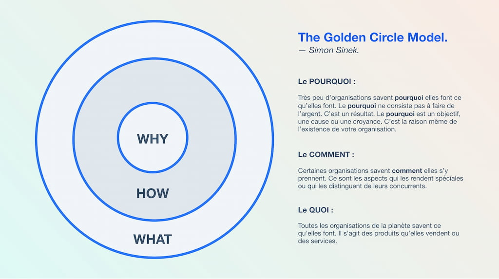
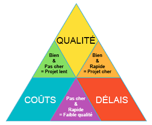

<h1 style="color: orange; text-align: center">Gestion-Projet</h1>

<h3 style="color: green">Golden Circle</h3>

Le Golden Circle est un concept développé et présenté par Simon Sinek, conférencier britannique spécialisé dans la motivation et le management. 

Pour Simon Sinek, la première question abordée dans un message promotionnel ne devrait pas être le « Qu'est-ce que c'est (What) ? » mais le « Pourquoi (Why) ? » L'entreprise doit donc s'efforcer d'expliquer pourquoi elle créé un produit ou un service, en rapport avec les valeurs défendues par l’entreprise.

<h3 style="color: green">Oeuvre et Ouvrage</h3>
<ul>
<li>Œuvre

Produit fourni par un travail et propre à un usage. La façon dont le travail est mené (ouvrage) a une influence sur l’œuvre (délais, qualité, satisfaction des clients etc.)
</li>
<li>Ouvrage

Définition, financement, organisation de l’action ou du travail en vue de la réalisation d’une mission. L’ensemble composé du produit fini (œuvre) et des conditions de sa réalisation contribue à l’accomplissement de la mission.
</li>
</ul>

<h3 style="color: green">Acteures</h3>
- MOA 

Le maître d'ouvrage est à l'origine du projet. On parle alors du commanditaire du projet. Il est le propriétaire du livrable et validera la conformité du livrable à ses attentes et exigences. Il s'agit généralement du client.

- MOE 

Le maître d’œuvre a la responsabilité de fournir le livrable du projet. Il s'agit généralement du chef de projet.

...

<h3 style="color: green">Triangle d'or</h3>

Il est possible de lire ce triangle de 3 façons :
- Un projet rapide et pas cher risque d’être de mauvaise qualité.
- Un projet rapide et de bonne qualité aura un coût élevé.
- Enfin, un projet pas cher, mais de bonne qualité peut prendre un certain temps à être réalisé.

<h3 style="color: green">PERT & Gantt</h3>

Les diagrammes PERT et de Gantt permettent aux chefs de projet de suivre les tâches et le statut du projet.

- PERT 
Les diagrammes PERT affichent les tâches dans un diagramme en réseau, qui met en évidence les interdépendances ; 

- Gantt 
Les diagrammes de Gantt indiquent les tâches et la chronologie sous forme de barres. 

 Tous deux ont leur place dans la structure de répartition du travail 

<h3 style="color: green">4P en gestion de projet</h3>

 --- Plan ---   --- Processus ---  --- Personnes ---  --- Pouvoir --- 

- Plan: Définir le plan et les objectifs du projet
- Processus: 
- Personnes:
- Pouvoir: le pouvoir fait ici référence au leadership. La gestion de projet implique une prise de décision. Avant de démarrer le projet, il est donc indispensable de se demander la façon dont l’autorité sera exercée, qu’elle soit formelle ou informelle

<h3 style="color: green"></h3>

